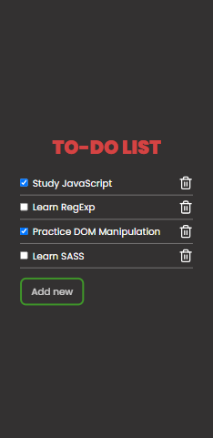

# Vanilla JS To-do App ✔️

Simple todo app built to practice DOM manipulation with Vanilla JavaScript.

- Live Site: [https://henriquepinheiro12.github.io/Vanilla-JS-Todo-List/](https://henriquepinheiro12.github.io/Vanilla-JS-Todo-List/)

## Screenshots 📸

## New features soon 🌠

- [] local storage

## Author 🧑‍💻

- Frontend Mentor - [@HenriquePinheiro12](https://www.frontendmentor.io/profile/HenriquePinheiro12)
- Github - [@HenriquePinheiroo12](https://github.com/henriquepinheiro12/)
- Linkedin - [@Henrique Pinheiro](https://www.linkedin.com/in/henrique-pinheiro-a43b62203/)
